# Color Conversion
## AIM
To perform the color conversion between RGB, BGR, HSV, and YCbCr color models.

## Software Required:
Anaconda - Python 3.7
## Algorithm:
### Step1:
Import cv2 library and upload the image or capture an image.
### Step2:
Read the saved image using cv2.imread("filename.jpg").

### Step3:
Convert the image into the given color transformation using cv2.cvtColor(image, cv2.BGR2YCrCb) and similarly for other color formats.

### Step4:
Split and merge the image using cv2.split(hsv) and cv2.merge([h,s,v])

### Step5: 
Output the image using cv2.imshow("OUTPUT", image)

## Program:
~~~
 Developed By: P.SANDEEP
 Register Number: 212221230074
~~~
## i) Convert BGR and RGB to HSV and GRAY
```
# BGR TO HSV

import cv2
image =cv2.imread('ship.jpg')
cv2.imshow('original',image)
b_h=cv2.cvtColor(image,cv2.COLOR_BGR2HSV)
cv2.imshow('BGR_HSV',b_h)
cv2.waitKey(0)
cv2.destroyAllWindows

# BGR TO GRAY

import cv2
image =cv2.imread('ship.jpg')
cv2.imshow('original',image)
b_g=cv2.cvtColor(image,cv2.COLOR_BGR2GRAY)
cv2.imshow('BGR_GRAY',b_g)
cv2.waitKey(0)
cv2.destroyAllWindows

# RGB TO HSV

import cv2
image =cv2.imread('ship.jpg')
cv2.imshow('original',image)
r_h=cv2.cvtColor(image,cv2.COLOR_RGB2HSV)
cv2.imshow('RGB_HSV',r_h)
cv2.waitKey(0)
cv2.destroyAllWindows

# RGB TO GRAY

import cv2
image =cv2.imread('ship.jpg')
cv2.imshow('original',image)
r_g=cv2.cvtColor(image,cv2.COLOR_RGB2GRAY)
cv2.imshow('RGB_GRAY',r_g)
cv2.waitKey(0)
cv2.destroyAllWindows

```


## ii)Convert HSV to RGB and BGR
```
# HSV TO RGB

import cv2
ori=cv2.imread('bgr2hsv.png')
cv2.imshow('hsvtorgb',ori)
h_r=cv2.cvtColor(ori,cv2.COLOR_HSV2RGB)
cv2.imshow('HSV_RGB',h_r)
cv2.waitKey(0)
cv2.destroyAllWindows

# HSV TO BGR

import cv2
ori=cv2.imread('bgr2hsv.png')
cv2.imshow('Original',ori)
h_b=cv2.cvtColor(ori,cv2.COLOR_HSV2BGR)
cv2.imshow('HSV_BGR',h_b)
cv2.waitKey(0)
cv2.destroyAllWindows

```


## iii)Convert RGB and BGR to YCrCb
```
# RGB TO YCrCb

import cv2
ori=cv2.imread('hsv2rgb.png')
YCrCb_image = cv2.cvtColor(ori, cv2.COLOR_RGB2YCrCb)
cv2.imshow('RGB_YCRCB',YCrCb_image)
cv2.waitKey(0)
cv2.destroyAllWindows

# BGR TO YCrCb

import cv2
image1=cv2.imread('ship.jpg')
YCrCb_image = cv2.cvtColor(image1, cv2.COLOR_BGR2YCrCb)
cv2.imshow('BGR_YCRCB',YCrCb_image)
cv2.waitKey(0)
cv2.destroyAllWindows


# iv)Split and Merge RGB Image

import cv2
img = cv2.imread("ship.jpg")
img1= cv2.resize(img, (270,180))
cv2
b,g,r = cv2.split(img1)
cv2.imshow("RED MODEL", r)
cv2.imshow("GREEN MODEL", g)
cv2.imshow("BLUE MODEL ", b)
merger = cv2.merge([b,g,r])
cv2.imshow("MERGED IMAGE", merger )
cv2.waitKey(0)
cv2.destroyAllWindows()


# v) Split and merge HSV Image

import cv2
img = cv2.imread("ship.jpg")
img1= cv2.resize(img, (270,180))
cv2
b,g,r = cv2.split(img1)
cv2.imshow("RED MODEL", r)
cv2.imshow("GREEN MODEL", g)
cv2.imshow("BLUE MODEL ", b)
merger = cv2.merge([b,g,r])
cv2.imshow("MERGED IMAGE", merger )
cv2.waitKey(0)
cv2.destroyAllWindows()
```

## Output:
### i) BGR and RGB to HSV and GRAY
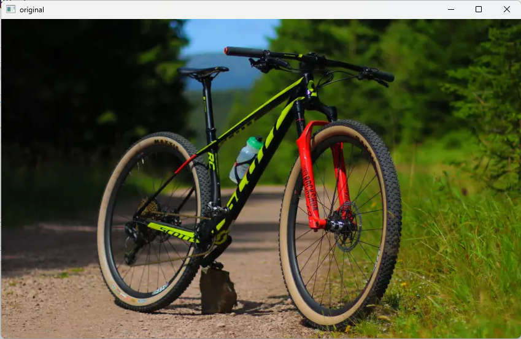

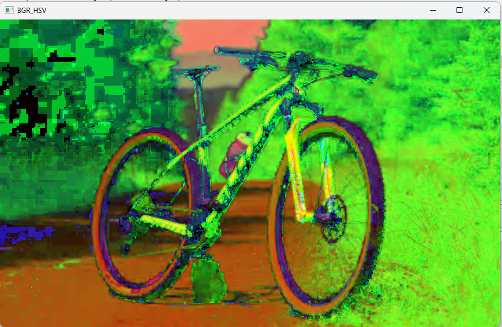
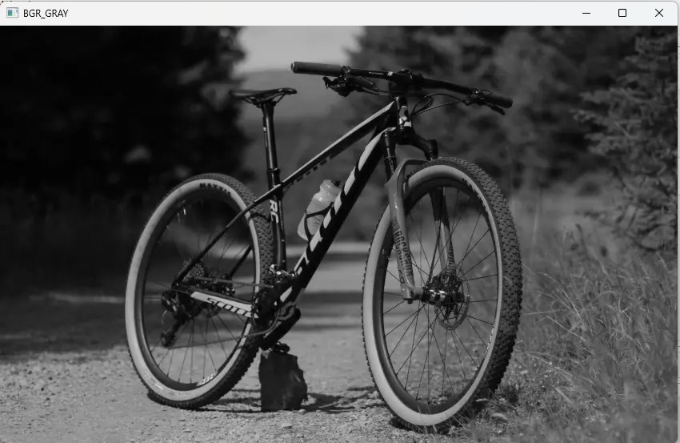
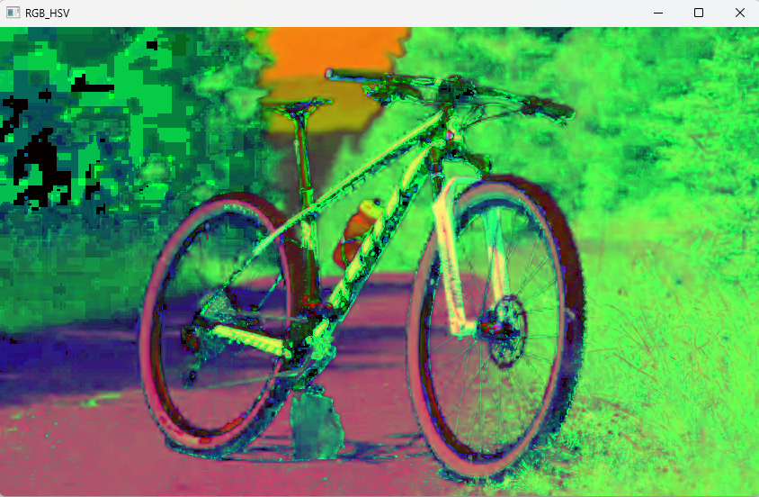
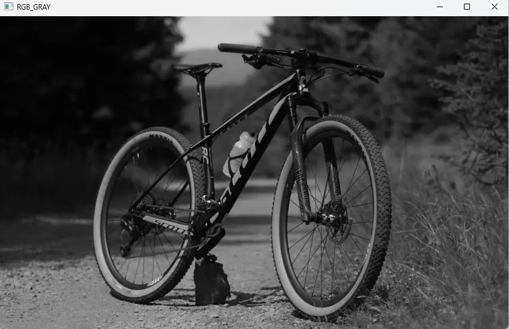

### ii) HSV to RGB and BGR
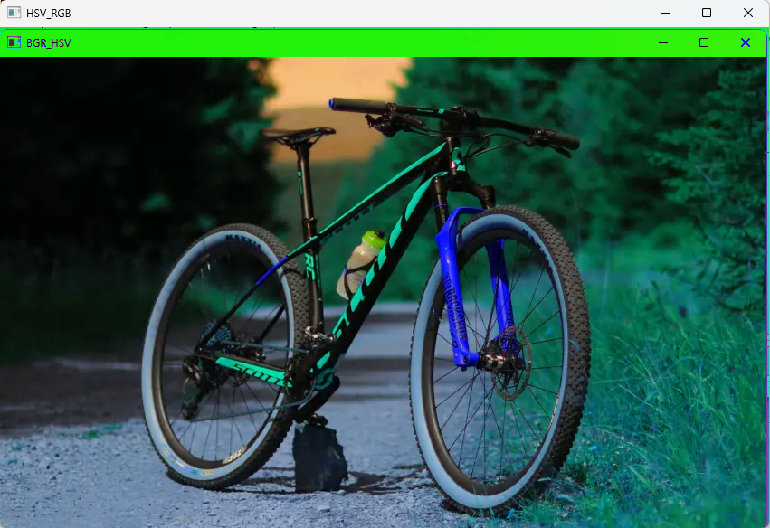
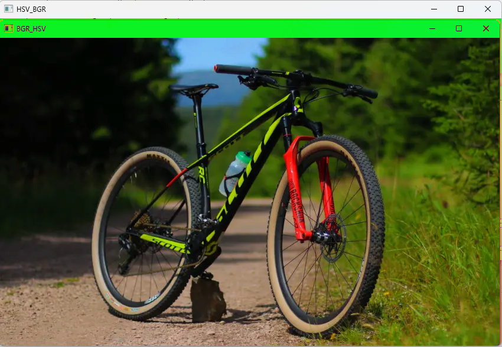

### iii) RGB and BGR to YCrCb
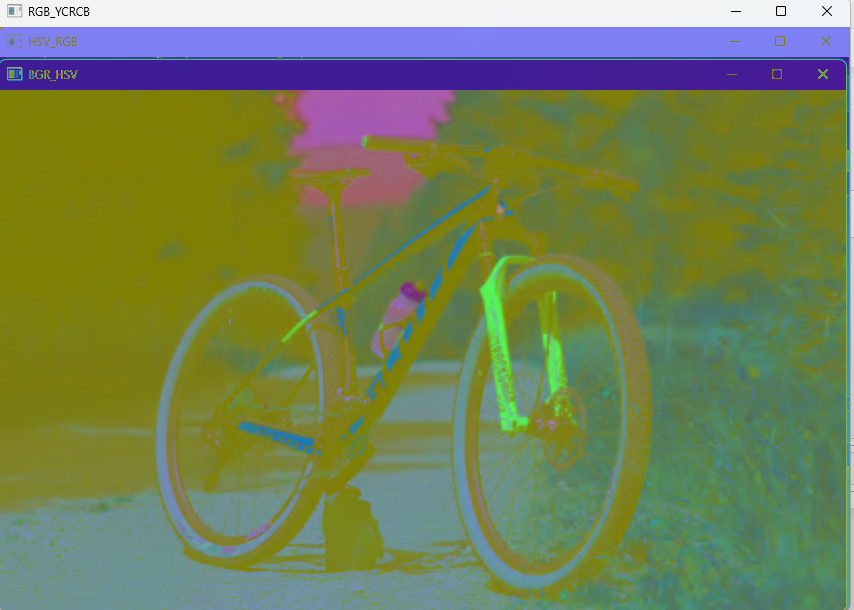
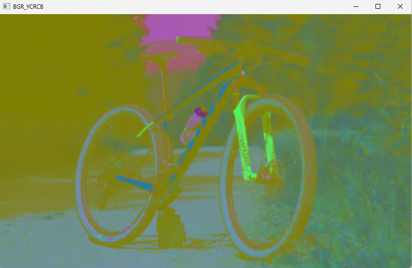
### iv) Split and merge RGB Image
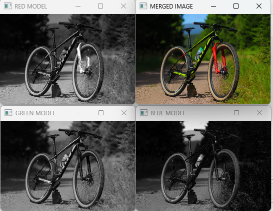

### v) Split and merge HSV Image
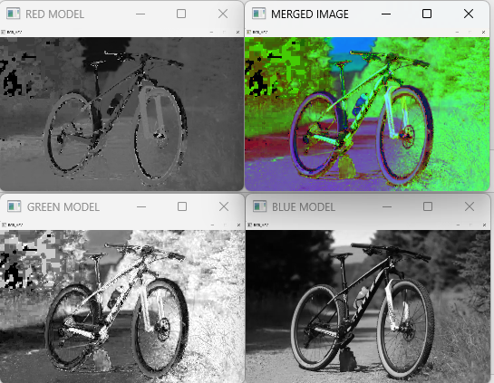


## Result:
Thus the color conversion was performed between RGB, HSV and YCbCr color models.
